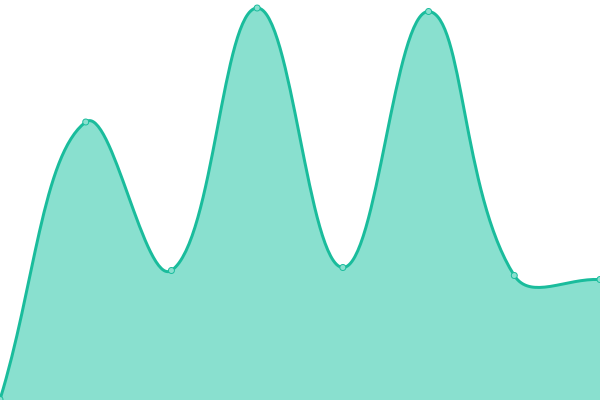

# [📈 Live Status](https://status.blazels.xyz): <!--live status--> **🟥 Complete outage**

This repository contains the open-source uptime monitor and status page for [Upptime](https://upptime.js.org), powered by [Upptime](https://github.com/upptime/upptime).

With [Upptime](https://upptime.js.org), you can get your own unlimited and free uptime monitor and status page, powered entirely by a GitHub repository. We use [Issues](https://github.com/upptime/upptime/issues) as incident reports, [Actions](https://github.com/blazels/stats/actions) as uptime monitors, and [Pages](https://status.blazels.xyz) for the status page.

<!--start: status pages-->
<!-- This summary is generated by Upptime (https://github.com/upptime/upptime) -->
<!-- Do not edit this manually, your changes will be overwritten -->
<!-- prettier-ignore -->
| URL | Status | History | Response Time | Uptime |
| --- | ------ | ------- | ------------- | ------ |
|  [BlazeLS](https://blazels.xyz) | 🟥 Down | [blaze-ls.yml](https://github.com/blazels/stats/commits/HEAD/history/blaze-ls.yml) | 

 0ms
     
 | 

<a href="https://status.blazels.xyz/history/blaze-ls">0.00%</a>
    

|  [CDN](https://cdn-user.blazels.xyz) | 🟥 Down | [cdn.yml](https://github.com/blazels/stats/commits/HEAD/history/cdn.yml) | 

 0ms
     
 | 

<a href="https://status.blazels.xyz/history/cdn">0.00%</a>
    

|  [Patch](https://cdn-up.blazels.xyz) | 🟥 Down | [patch.yml](https://github.com/blazels/stats/commits/HEAD/history/patch.yml) | 

 0ms
     
 | 

<a href="https://status.blazels.xyz/history/patch">0.00%</a>
    

|  [Storage](https://s3.jagoanstorage.com/download/index.html) | 🟥 Down | [storage.yml](https://github.com/blazels/stats/commits/HEAD/history/storage.yml) | 

 0ms
     
 | 

<a href="https://status.blazels.xyz/history/storage">0.00%</a>
    

|  [SQLServ](azure.blazels.xyz) | 🟥 Down | [sql-serv.yml](https://github.com/blazels/stats/commits/HEAD/history/sql-serv.yml) | 

 0ms
     
 | 

<a href="https://status.blazels.xyz/history/sql-serv">0.00%</a>
    

|  [Gamesvr](server.blazels.xyz) | 🟥 Down | [gamesvr.yml](https://github.com/blazels/stats/commits/HEAD/history/gamesvr.yml) | 

 0ms
     
 | 

<a href="https://status.blazels.xyz/history/gamesvr">0.00%</a>
    

<!--end: status pages-->

[**Visit our status website →**](https://status.blazels.xyz)

## 📄 License

- Powered by: [Upptime](https://github.com/upptime/upptime)
- Code: [MIT](./LICENSE) © [Upptime](https://upptime.js.org)
- Data in the `./history` directory: [Open Database License](https://opendatacommons.org/licenses/odbl/1-0/)
